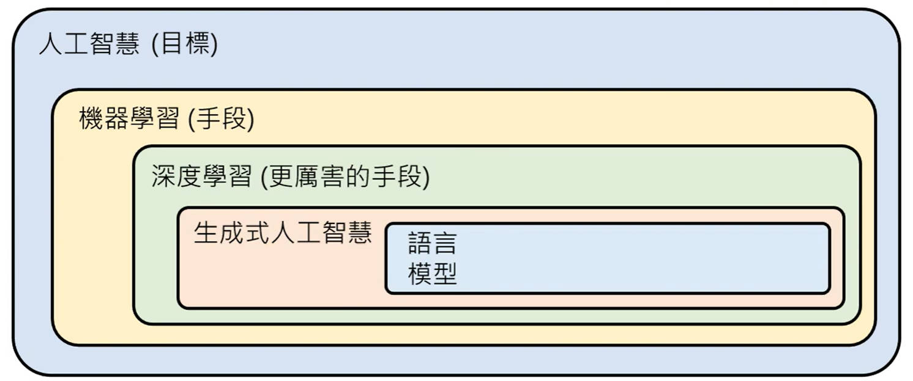

 

**1. 生成式人工智能（Generative AI）的定义**

- 要让机器产生复杂而有结构的物件，如文章、影像和语音等。
- 这些物件由一系列数据构成，如文字、像素和取样点等。
- 生成式人工智能要解决的问题是无法穷举的，即无法通过列举所有可能性来找到解决方案。


分类（classification） 从有限的选项做选择。（不是生成人工智能）


由浅到深的，很通识介绍生成式AI的一些概念


**机器学习（machine learning）** = 机器从资料中找到一个函数（函式）如：

```
y= f(x) = ax+b 
```

a、b 是参数（parameter）。


这是一个简单的函数，数学中，我们可以自己解。机器学习是自动找出参数的方法。 


举一个机器学习的例子，一个可以分辨猫和狗的机器。函数如下：

```
cat or dog = f(picture.jpg) = a...b...c...d...e (上万的参数)
```

这上万的参数的式子就是**模型**。

 

训练的过程就是不断的输入输出，找出这个上万的参数。这个过程也叫**学习（learning）**。帮忙你找出这上万的参数的输入输出叫做训练资料。

找到上万参数之后， 再次输入看看是否能得到自己想要的结果，这个过程叫**测试（testing）** 或 **推论（ inference）**。 

这上万个未知参数的函数，在机器学习领域中，通常把它表示成**神经网络（Neural Network）**。

把这个上万的未知参数的函数解出来，就是**深度学习**。

机器学习有很多种描述方法 ，但是用神经网络的这种方法来描述这个函数时，就是深度学习。 

生成式AI，可以机器学习来实现，也可以用其他的方式来实现。机器学习中生成式AI实现的手段。

生成式AI目前通常都是通过深度学习来达成的。

人工智能是一个目标，而机器学习是实现这个目标的一种方法。


transformet 神经网络的一种，ChatGPT背后运用的模型。  

生成式AI的挑战是什么？


语言模型是一个在做文字接龙的模型，它可以生成一系列的文字来完成某个任务。语言模型并不是生成式人工智慧的全部，它只是其中的一个技术。事实上，生成并不一定要用文字接龙的方式生成，可以有不同的策略。语言模型可以通过预训练来学习多种不同的语言和任务，从而提高其能力。在使用语言模型时，需要确保它能够理解你的需求，否则它可能无法发挥出应有的能力。



自回归生成（Autoregressive Generation）是一种在自然语言处理（NLP）和机器学习领域中常用的技术，它是基于自回归模型（Autoregressive Model）的生成过程。自回归模型是一种预测模型，它的基本思想是利用过去的数据（或者说，历史数据）来预测未来的数据。在自然语言处理中，自回归生成通常用于生成文本，其中模型会根据之前的文本内容来生成新的文本内容。

自回归生成的基本步骤如下：

1. **模型训练**：首先，模型需要在大量的文本数据上进行训练。训练过程中，模型会学习到文本中的模式和结构，以便在未来的生成过程中能够准确地预测和生成文本。

1. **生成过程**：在训练完成后，模型可以用于生成新的文本。生成过程通常是一个迭代的过程，模型会根据当前的文本内容（或者说，历史数据）来预测下一个词或字符，然后将这个预测的词或字符添加到文本中，作为新的历史数据。这个过程会持续进行，直到生成的文本达到预定的长度或者满足其他停止条件。

1. **评估和优化**：生成的文本的质量和准确性是非常重要的。因此，模型的训练和生成过程通常会包括评估和优化的步骤，以确保生成的文本既符合预期的主题和风格，又具有高的质量和准确性。

自回归生成在许多应用中都有广泛的应用，包括文本摘要、文本翻译、对话系统等。它的优点是能够生成连贯和有意义的文本，而且可以根据需要生成具有特定主题和风格的文本。然而，它也有一些局限性，比如可能会生成重复的内容，或者在处理复杂的语言结构时可能会遇到困难。

总的来说，自回归生成是一种强大的技术，它在自然语言处理和机器学习领域中有着广泛的应用。