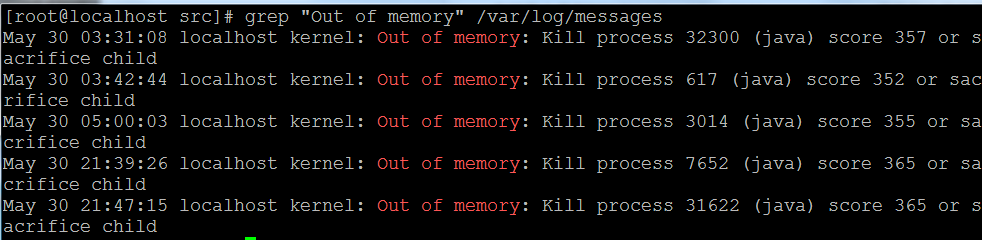

# 内存泄漏

内存泄漏， 最明显的场景就是导致进程占用的内存越来越大。最后被系统 kill  掉。 ，系统根据整体负载情况，它会为每个进程计算一个oom_score，并在内存资源紧张时选择一个合适的进程杀死并回收内存资源。 

see [how does the oom killer decide which process to kill first](https://unix.stackexchange.com/a/153586/95211)。

进程被 kill 掉之后， 我们怎么知道是因为 内存泄漏的呢？ 可以看 `/proc/messages` 来确认是否有对应日志。

[https://www.cnblogs.com/duanxz/p/10185946.html](https://www.cnblogs.com/duanxz/p/10185946.html)

# golang   GC 

golang  的设计本身就有自动管理内存的特性。 不像C\C++语言要 开发者显式的调用malloc、free，或者new、delete进行回收。

垃圾回收算法有比如：引用计数、标记清除、拷贝、分代等等。

Go中垃圾回收器采用的是“并发三色标记清除”算法:

1. [Garbage Collection In Go : Part I - Semantics](https://www.ardanlabs.com/blog/2018/12/garbage-collection-in-go-part1-semantics.html)
2. [Garbage Collection In Go : Part II - GC Traces](https://www.ardanlabs.com/blog/2019/05/garbage-collection-in-go-part2-gctraces.html)
3. [Garbage Collection In Go : Part III - GC Pacing](https://www.ardanlabs.com/blog/2019/07/garbage-collection-in-go-part3-gcpacing.html)

垃圾回收（gc）算法能够对堆内存进行有效的清理 这是肯定的，垃圾回收能够正常运行的前提是，程序中必须解除对内存的引用，这样垃圾回收才会将其判定为可回收内存并回收。

#  内存泄露排查

见的内存泄露场景，go101进行了讨论，总结了如下几种：

- [Kind of memory leaking caused by substrings](https://go101.org/article/memory-leaking.html)
- [Kind of memory leaking caused by subslices](https://go101.org/article/memory-leaking.html)
- [Kind of memory leaking caused by not resetting pointers in lost slice elements](https://go101.org/article/memory-leaking.html)
- [Real memory leaking caused by hanging goroutines](https://go101.org/article/memory-leaking.html)
- [real memory leadking caused by not stopping `time.Ticker` values which are not used any more](https://go101.org/article/memory-leaking.html)
- [Real memory leaking caused by using finalizers improperly](https://go101.org/article/memory-leaking.html)
- [Kind of resource leaking by deferring function calls](https://go101.org/article/defer-more.html#kind-of-resource-leaking)
# 资料：

1、[https://www.hitzhangjie.pro/blog/2021-04-14-go程序内存泄露问题快速定位/](https://www.hitzhangjie.pro/blog/2021-04-14-go程序内存泄露问题快速定位/)

