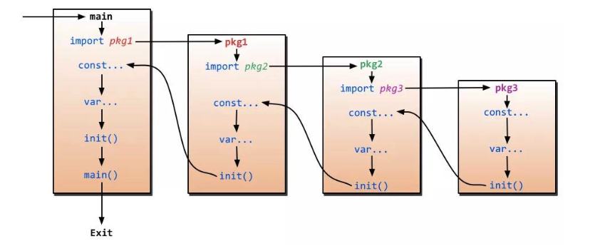

# 基础题

### 1、 `=` 和 `:=` 的区别？

`:=` 声明+赋值，`=` 仅赋值。

### 2、 指针的作用？

指针用来保存变量的地址。 `*` 运算符，也称为解引用运算符，用于访问地址中的值。`＆` 运算符，也称为地址运算符，用于返回变量的地址。

### 3、Go 有异常类型吗？

Go 没有异常类型，只有错误类型（`Erro`r），通常使用返回值来表示异常状态。

```go
f, err := os.Open("test.txt")
if err != nil {
    log.Fatal(err)
}
```
### 4、什么是协程（Goroutine）
`Goroutine` 是与其他函数或方法同时运行的函数或方法。 `Goroutines` 可以被认为是轻量级的线程。 与线程相比，创建 `Goroutine` 的开销很小。 Go应用程序同时运行数千个 `Goroutine` 是非常常见的做法。

### 5、如何高效地拼接字符串

Go 语言中，字符串是只读的，也就意味着每次修改操作都会创建一个新的字符串。如果需要拼接多次，应使用 `strings.Builder`，最小化内存拷贝次数。

```go
var str strings.Builder
for i := 0; i < 1000; i++ {
    str.WriteString("a")
}
fmt.Println(str.String())
```
### 6、什么是 rune 类型

[http://blog.xyecho.com/go-uint8-and-rune](http://blog.xyecho.com/go-uint8-and-rune)


### 7、如何判断 map 中是否包含某个 key ？

```go
if val, ok := dict["foo"]; ok {
    //do something here
}
```
`dict["foo"]` 有 2 个返回值，val 和 ok，如果 ok 等于 true，则说明 dict 包含 `key "foo"`，val 将被赋予 "foo" 对应的值。

### 8、defer 的执行顺序

多个 `defer` 语句，遵从后进先出(Last In First Out，LIFO)的原则，最后声明的 `defer` 语句，最先得到执行。
`defer` 在 return 语句之后执行，但在函数退出之前，defer 可以修改返回值。

 下面的 `defer` 函数中并没有改变 返回 i 的值。Go 的返回机制决定的，执行 `return` 语句后，Go 会创建一个临时变量保存返回值，因此，`defer` 语句修改了局部变量 i，并没有修改返回值。

```go 
func test() int {
	i := 0
	defer func() {
		fmt.Println("defer1")
	}()
	defer func() {
		i += 1
		fmt.Println("defer2")
	}()
	return i
}

func main() {
	fmt.Println("return", test())
}

// defer2
// defer1
// return 0
```

下面的 	`defer` 就可能改变  `return i` 的值，因为 i 不是一个临时变量。

```go 
func test() (i int) {
	i = 0
	defer func() {
		i += 1
		fmt.Println("defer2")
	}()
	return i
}

func main() {
	fmt.Println("return", test())
}
// defer2
// return 1
```

 defer 语句的时候会保存一份副本

```go
func hello(i int) {  
    fmt.Println(i) // 5 
}
func main() {  
    i := 5
    defer hello(i)
    i = i + 10
}
```

hello() 函数的参数在执行 defer 语句的时候会保存一份副本，在实际调用 hello() 函数时用，所以是 5.

```go
func increaseA() int {
    var i int
    defer func() {
        i++
    }()
    return i
}

func increaseB() (r int) {
    defer func() {
        r++
    }()
    return r
}

func main() {
    fmt.Println(increaseA())
    fmt.Println(increaseB())
}
```

返回  0 1

```go
type Person struct {
    age int
}

func main() {
    person := &Person{28}

    // 1. 
    defer fmt.Println(person.age)

    // 2.
    defer func(p *Person) {
        fmt.Println(p.age)
    }(person)  

    // 3.
    defer func() {
        fmt.Println(person.age)
    }()

    person.age = 29
}
```

29 29 28。变量 person 是一个指针变量 。

1.person.age 此时是将 28 当做 defer 函数的参数，会把 28 缓存在栈中，等到最后执行该 defer 语句的时候取出，即输出 28；

2.defer 缓存的是结构体 Person{28} 的地址，最终 Person{28} 的 age 被重新赋值为 29，所以 defer 语句最后执行的时候，依靠缓存的地址取出的 age 便是 29，即输出 29；

3.闭包引用，输出 29；

又由于 defer 的执行顺序为先进后出，即 3 2 1，所以输出 29 29 28。

```go
type Person struct {
    age int
}

func main() {
    person := &Person{28}

    // 1.
    defer fmt.Println(person.age)

    // 2.
    defer func(p *Person) {
        fmt.Println(p.age)
    }(person)

    // 3.
    defer func() {
        fmt.Println(person.age)
    }()

    person = &Person{29}
}
```

参考答案及解析：29 28 28。这道题在第 19 天题目的基础上做了一点点小改动，前一题最后一行代码 person.age = 29 是修改引用对象的成员 age，这题最后一行代码 person = &Person{29} 是修改引用对象本身，来看看有什么区别。

1处.person.age 这一行代码跟之前含义是一样的，此时是将 28 当做 defer 函数的参数，会把 28 缓存在栈中，等到最后执行该 defer 语句的时候取出，即输出 28；

2处.defer 缓存的是结构体 Person{28} 的地址，这个地址指向的结构体没有被改变，最后 defer 语句后面的函数执行的时候取出仍是 28；

3处.闭包引用，person 的值已经被改变，指向结构体 Person{29}，所以输出 29.

由于 defer 的执行顺序为先进后出，即 3 2 1，所以输出 29 28 28。


return 之后的 defer 语句会执行吗，下面这段代码输出什么

```go
var a bool = true
func main() {
    defer func(){
        fmt.Println("1")
    }()
    if a == true {
        fmt.Println("2")
        return
    }
    defer func(){
        fmt.Println("3")
    }()
}
```

2 1。defer 关键字后面的函数或者方法想要执行必须先注册，return 之后的 defer 是不能注册的， 也就不能执行后面的函数或方法.

```go
func main() {
    a := 1
    b := 2
    defer calc("1", a, calc("10", a, b))
    a = 0
    defer calc("2", a, calc("20", a, b))
    b = 1
}

func calc(index string, a, b int) int {
    ret := a + b
    fmt.Println(index, a, b, ret)
    return ret
}
```

结果：

```sh
10 1 2 3
20 0 2 2
2 0 2 2
1 1 3 4
```


### 9、如何交换 2 个变量的值？

```go 
a, b := "A", "B"
a, b = b, a
fmt.Println(a, b) // B A
```

### 10、Go 语言 tag 的用处？

`tag` 可以理解为 `struct` 字段的注解，可以用来定义字段的一个或多个属性。框架/工具可以通过反射获取到某个字段定义的属性，采取相应的处理方式。`tag` 丰富了代码的语义，增强了灵活性。

```go 
package main

import "fmt"
import "encoding/json"

type Stu struct {
	Name string `json:"stu_name"`
	ID   string `json:"stu_id"`
	Age  int    `json:"-"`
}

func main() {
	buf, _ := json.Marshal(Stu{"Tom", "t001", 18})
	fmt.Printf("%s\n", buf)
}

```

### 11、如何判断 2 个字符串切片（slice) 是相等的？

go 语言中可以使用反射 `reflect.DeepEqual(a, b)` 判断 `a`、`b` 两个切片是否相等，但是通常不推荐这么做，使用反射非常影响性能。

通常采用的方式如下，遍历比较切片中的每一个元素（注意处理越界的情况）。

```go 
func StringSliceEqualBCE(a, b []string) bool {
    if len(a) != len(b) {
        return false
    }

    if (a == nil) != (b == nil) {
        return false
    }

    b = b[:len(a)]
    for i, v := range a {
        if v != b[i] {
            return false
        }
    }

    return true
}
```

### 12、字符串打印时，%v 和 %+v 的区别

`%v `和 `%+v` 都可以用来打印 `struct` 的值，区别在于 `%v` 仅打印各个字段的值，`%+v` 还会打印各个字段的名称。

```go 
type Stu struct {
	Name string
}

func main() {
	fmt.Printf("%v\n", Stu{"Tom"})  // {Tom}
	fmt.Printf("%+v\n", Stu{"Tom"}) // {Name:Tom}
}
```

### 13、Go 语言中如何表示枚举值(enums)

通常使用常量(`const`) 来表示枚举值。

```go 
type StuType int32

const (
	Type1 StuType = iota
	Type2
	Type3
	Type4
)

func main() {
	fmt.Println(Type1, Type2, Type3, Type4) // 0, 1, 2, 3
}
```

### 14、struct{} 的用途

使用空结构体 `struct{}` 可以节省内存，一般作为占位符使用，表明这里并不需要一个值。

```go
fmt.Println(unsafe.Sizeof(struct{}{})) // 0
```

使用 map 表示集合时，只关注 key，value 可以使用 `struct{}` 作为占位符。
```go 
type Set map[string]struct{}

func main() {
	set := make(Set)

	for _, item := range []string{"A", "A", "B", "C"} {
		set[item] = struct{}{}
	}
	fmt.Println(len(set)) // 3
	if _, ok := set["A"]; ok {
		fmt.Println("A exists") // A exists
	}
}
```
使用信道( `channel` )控制并发时，我们只是需要一个信号，但并不需要传递值，这个时候，也可以使用 `struct{}` 代替。

```go 
func main() {
	ch := make(chan struct{}, 1)
	go func() {
		<-ch
		// do something
	}()
	ch <- struct{}{}
	// ...
}
```

### 下面这段代码输出什么，说明原因

```go
func main() {

     slice := []int{0,1,2,3}
     m := make(map[int]*int)

     for key,val := range slice {
         m[key] = &val
     }

    for k,v := range m {
        fmt.Println(k,"->",*v)
    }
}
```

答案：

```
0 -> 3
1 -> 3
2 -> 3
3 -> 3
```

参考解析：这是新手常会犯的错误写法，for range 循环的时候会创建每个元素的副本，而不是元素的引用，所以 m[key] = &val 取的都是变量 val 的地址，所以最后 map 中的所有元素的值都是变量 val 的地址，因为最后 val 被赋值为3，所有输出都是3.

正确的写法:

```go
func main() {

     slice := []int{0,1,2,3}
     m := make(map[int]*int)

     for key,val := range slice {
         value := val
         m[key] = &value
     }

    for k,v := range m {
        fmt.Println(k,"===>",*v)
    }
}
```

### new() 与 make() 的区别

Go语言中的 new 和 make 主要区别如下：

- make 只能用来分配及初始化类型为 slice、map、chan 的数据。new 可以分配任意类型的数据；
- new 分配返回的是指针，即类型 *Type。make 返回引用，即 Type；
- new 分配的空间被清零。make 分配空间后，会进行初始化

###  变量声明的简短模式

下面这段代码能否通过编译，如果可以，输出什么？

```go
var(
    size := 1024 // 正确： size = 1024 
    max_size = size*2
)

func main() {
    fmt.Println(size,max_size)
}
```

不能通过编译。这道题的主要知识点是变量声明的简短模式，形如：x := 100。但这种声明方式有限制：

1.必须使用显示初始化；
2.不能提供数据类型，编译器会自动推导；
3.只能在函数内部使用简短模式；

### 结构体的比较

```go
func main() {
    sn1 := struct {
        age  int
        name string
    }{age: 11, name: "qq"}
    sn2 := struct {
        age  int
        name string
    }{age: 11, name: "qq"}

    if sn1 == sn2 {
        fmt.Println("sn1 == sn2")
    }

    sm1 := struct {
        age int
        m   map[string]string
    }{age: 11, m: map[string]string{"a": "1"}}
    sm2 := struct {
        age int
        m   map[string]string
    }{age: 11, m: map[string]string{"a": "1"}}

    if sm1 == sm2 {
        fmt.Println("sm1 == sm2")
    }
}
```

结构体的比较，有几个需要注意的地方：

- 结构体只能比较是否相等，但是不能比较大小。
- 。相同类型的结构体才能够进行比较，结构体是否相同不但与属性类型有关，还与属性顺序相关。
- 如果 struct 的所有成员都可以比较，则该 struct 就可以通过 == 或 != 进行比较是否相等，比较时逐个项进行比较，如果每一项都相等，则两个结构体才相等，否则不相等。
- 常见的有 bool、数值型、字符、指针、数组等，**像切片、map、函数等是不能比较的**。


```go
func main() {
    a := [2]int{5, 6}
    b := [3]int{5, 6}
    if a == b {
        fmt.Println("equal")
    } else {
        fmt.Println("not equal")
    }
}
```

结果：compilation error 。Go 中的数组是值类型，可比较，另外一方面，数组的长度也是数组类型的组成部分，所以 a 和 b 是不同的类型，是不能比较的，所以编译错误。

### 类型别名与类型定义

```go
package main

import "fmt"

type MyInt1 int
type MyInt2 = int

func main() {
    var i int =0
    var i1 MyInt1 = i 
    var i2 MyInt2 = i
    fmt.Println(i1,i2)
}
```

- `type MyInt1 int`  创建了新类型 MyInt1 。` type MyInt2 = int`  创建了 int 的类型别名 MyInt2。
- Go 是强类型语言，` var i1 MyInt1 = i `   `int` 赋值给 `MyInt1` 是不行的，要先转换一下，`var i1 MyInt1 = MyInt1(i)` 。

### nil 值

下面赋值正确的是  BD

- A. var x = nil
- B. var x interface{} = nil
- C. var x string = nil
- D. var x error = nil

nil 只能赋值给指针、chan、func、interface、map 或 slice 类型的变量。强调下 D 选项的 error 类型，它是一种内置接口类型，看下方贴出的源码就知道，所以 D 是对的。


### nil 切片和空切片

#### 下面代码下划线处可以填入 s1？ 

```go
func main() {
    var s1 []int
    var s2 = []int{}
    if __s1 == nil {
        fmt.Println("yes nil")
    }else{
        fmt.Println("no nil")
    }
}
```

nil 切片和空切片。nil 切片和 nil 相等，一般用来表示一个不存在的切片；空切片和 nil 不相等，表示一个空的集合。

```go
var a []int  // A
a := []int{} // B
```

A 声明的是 nil 切片；B 声明的是长度和容量都为 0 的空切片。第一种切片声明不会分配内存，优先选择。

###  init函数

- init() 函数是用于程序执行前做包的初始化的函数，比如初始化包里的变量等;
- 一个包可以出现多个 init() 函数,一个源文件也可以包含多个 init() 函数；
- 同一个包中多个 init() 函数的执行顺序没有明确定义，但是不同包的init函数是根据包导入的依赖关系决定的（看下图）;
- init() 函数在代码中不能被显示调用、不能被引用（赋值给函数变量），否则出现编译错误;
- 一个包被引用多次，如 A import B,C import B,A import C，B 被引用多次，但 B 包只会初始化一次；
- 引入包，不可出现死循坏。即 A import B,B import A，这种情况编译失败；




### 切片 操作符 [i,j]

```go
package main

import (  
    "fmt"
)

func main() {  
    a := [5]int{1, 2, 3, 4, 5}
    t := a[3:4:4]
    fmt.Println(t[0]) // 4
}
```

操作符 [i,j]。基于数组（切片）可以使用操作符 [i,j] 创建新的切片，从索引 i，到索引 j 结束，截取已有数组（切片）的任意部分，返回新的切片，新切片的值包含原数组（切片）的 i 索引的值，但是不包含 j 索引的值。i、j 都是可选的，i 如果省略，默认是 0，j 如果省略，默认是原数组（切片）的长度。i、j 都不能超过这个长度值。

假如底层数组的大小为 k，截取之后获得的切片的长度和容量的计算方法：长度：j-i，容量：k-i。

**截取操作符还可以有第三个参数，形如 [i,j,k]，第三个参数 k 用来限制新切片的容量，但不能超过原数组（切片）的底层数组大小。截取获得的切片的长度和容量分别是：j-i、k-i**。

