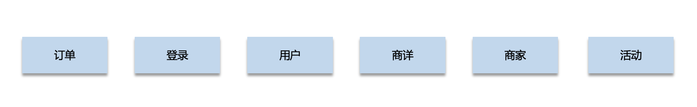

# 事务

事务基本特性 `ACID` 分别是:

**原子性** 指的是一个事务中的操作要么全部成功，要么全部失败。

**一致性** 指的是数据库总是从一个一致性的状态转换到另外一个一致性的状态。比如A转账给B100块钱，假设中间 sql 执行过程中系统崩溃A也不会损失100块，因为事务没有提交，修改也就不会保存到数据库。

**隔离性** 指的是一个事务的修改在最终提交前，对其他事务是不可见的。

**持久性** 指的是一旦事务提交，所做的修改就会永久保存到数据库中。

# 隔离性有4个隔离级别

**read uncommit** 读未提交，可能会读到其他事务未提交的数据，也叫做脏读。

**read commit** 读已提交，两次读取结果不一致，叫做不可重复读。

**repeatable read** 可重复复读，这是mysql的默认级别，就是每次读取结果都一样，但是有可能产生幻读。

**serializable** 串行，一般是不会使用的，他会给每一行读取的数据加锁，会导致大量超时和锁竞争的问题。

# 靠什么保证的 ACID

- **A 原子性** 由 `undo log` 日志保证，它记录了需要回滚的日志信息，事务回滚时撤销已经执行成功的sql
- **C 一致性** 一般由代码层面来保证
- **I 隔离性** 由 `MVCC` 来保证
- **D 持久性** 由内存+ `redo log` 来保证，mysql 修改数据同时在内存和 `redo log`记录这次操作，事务提交的时候通过`redo log`刷盘，宕机的时候可以从`redo log`恢复。

# 怎么分表表库

分表分库有两种方式：水平方式和垂直方式。

## 垂直方式

其实就是按业务角度进行分表分库。如：

## 水平方式

根据业务场景来决定使用什么字段作为分表字段(sharding) 如：订单ID(order_id), 商品ID（sku_id）,商家ID（vender_id）等。

一般，我们以 `vender_id % 1024` 的方式进行分表, t_vender_id_0, t_vender_id_1,t_vender_id_1023。

分表后不用自增ID，分布式的数据存储一般都不用考虑自增ID的业务意义，而是考虑分布式ID，或者业务ID。如果sku_id 就是全局惟一的ID。

## 分库分表后的查询

1、我们提供一个**映射查询接口**，如： 我们以 vender_id 分表分库，而我们要通过 sku_id 查询时是没有办法查询到的，我们只能通过 sku_id 和 vender_id 的映射查询接口，查询到 sku_id 对应的 vender_id 再通过 vender_id 和 sku_id 一起查询相关的信息。

2、通过离线数据，如：分表的数据现步到数据集市形成一个宽表，然后查询宽表。这种试查询比较耗时，对于没有时效要求的需求可行。

3、通过 es 系统，把数据同步到 es 系统中。然后进行查询。

