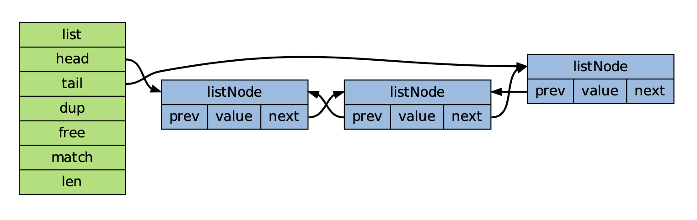

# 资源

redis的官网： [http://redis.io/](http://redis.io/)
redis 官方界面客户端：[https://github.com/RedisInsight/RedisInsight](https://github.com/RedisInsight/RedisInsight)
在线测试： [http://try.redis.io/](http://try.redis.io/)

redis scan: [https://jinguoxing.github.io/redis/2018/09/04/redis-scan/](https://jinguoxing.github.io/redis/2018/09/04/redis-scan/)
# 安装 

Redis的安装相对来的不难，以下主要是 centos 系统做为环境。

下载页面： [http://redis.io/download](http://redis.io/download)

百度云地址 :[http://pan.baidu.com/s/1slsCr97](http://pan.baidu.com/s/1slsCr97)

安装

```sh
$ tar xzf  redis-2.8.13.tar.gz
$ cd redis-2.8.13
$ make
$ make install
$ cp redis.conf /etc/
```

文件说明

`make install` 命令执行完成后，会在 `/usr/local/bin` 目录下生成本个可执行文件，分别是 `redis-server`、`redis-cli`、`redis-benchmark`、`redis-check-aof` 、`redis-check-dump`，它们的作用如下：

```sh
redis-server：Redis 服务器的 daemon 启动程序
redis-cli：Redis 命令行操作工具。也可以用 telnet 根据其纯文本协议来操作
redis-benchmark：Redis 性能测试工具，测试 Redis 在当前系统下的读写性能
redis-check-aof：数据修复
redis-check-dump：检查导出工具
```
启动 redis

```sh
 /usr/local/bin/redis-server /etc/redis.conf

// 检查是否启动成功
 ps -ef | grep redis
 ````
查看 redis 的版本 
查看 redis 的版本有两种方式：

方式一
```sh 
redis-server --version  # 或 redis-server -v 
Redis server v=2.6.10 sha=00000000:0 malloc=jemalloc-3.2.0 bits=32
```

方式二
```sh
redis-cli --version # 或 redis-cli -v
```

得到的结果是：`redis-cli 2.6.10`

严格上说：通过　redis-cli 得到的结果应该是redis-cli 的版本，但是 redis-cli 和r edis-server　一般都是从同一套源码编译出的。所以应该是一样的。

# Redis 文件说明

```sh
$ find . -type f -executable
./redis-benchmark      // 用于进行redis性能测试的工具

./redis-check-dump     // 用于修复出问题的dump.rdb文件
./redis-cli            // redis的客户端
./redis-server         // redis的服务端
./redis-check-aof      // 用于修复出问题的AOF文件
./redis-sentinel       // 用于集群管理
```

Redis 命令大致可分为以下几种：

- 服务端（server）命令
- 客户端（client）命令
- 键命令（key）
- 数据类型命令
- 功能应用命令

redis 内部数据结构

# Redis 配置

1、redis 配置文件一般是在 `/etc/redis.conf`
2、redis 官方提供的 redis.conf 文件，足有700+行，其中100多行为有效配置行，另外的600多行为注释说明。
3、redis 配置中对单位的大小写不敏感，1GB、1Gb 和 1gB 都是相同的。由此也说明，redis 只支持 bytes，不支持 bit 单位。
4、redis 支持主配置文件中引入外部配置文件 `include /path/to/other.conf`
5、redis 配置文件被分成了几大块区域:
 ```
1) 通用（general）
2) 快照（snapshotting）
3) 复制（replication）
4) 安全（security）
5) 限制（limits)
6) 追加模式（append only mode)
7) LUA脚本（lua scripting)
8) 慢日志（slow log)
9) 事件通知（event notification）
 ```

# 命令


在线练习工具：[https://try.redis.io/](https://try.redis.io/)
查看更多命令：[https://redis.io/commands](https://redis.io/commands)

服务启动：
```sh
./redis-server ../redis.conf  端口默认为6379
```
 
 使用客户端：
```sh
./redis-cli
```

通过客户端来关闭redis服务端 

```sh
 127.0.0.1:6379> shutdown 
```

 一些注意:
  - key不要太长，尽量不要超过1024字节，这不仅消耗内存，而且会降低查找的效率；
  - key也不要太短，太短的话，key的可读性会降低；
  - 在一个项目中，key最好使用统一的命名模式，例如user:10000:passwd。
  - 字符串类型的用法就是这么简单，因为是二进制安全的，所以你完全可以把一个图片文件的内容作为字符串来存储。

 **连接控制**

- `QUIT` 关闭连接
- `AUTH` (仅限启用时)简单的密码验证

**适合全体类型的命令**

- `EXISTS key` 判断一个键是否存在;存在返回 1;否则返回 0;
- `DEL key` 删除某个 key,或是一系列 key;DEL key1 key2 key3 key4
- `TYPE key` 返回某个 key 元素的数据类型 ( none:不存在,string:字符,list,set,zset,hash)
- `KEYS pattern` 返回匹配的 key 列表 (KEYS foo*:查找 foo 开头的 keys)
- `RANDOMKEY` 随机获得一个已经存在的 key，如果当前数据库为空，则返回空字符串
- `RENAME oldname newname` 更改 key 的名字，新键如果存在将被覆盖
- `RENAMENX oldname newname` 更改 key 的名字，如果名字存在则更改失败
- `DBSIZE` 返回当前数据库的 key 的总数
- `EXPIRE` 设置某个 key 的过期时间(秒),(EXPIRE bruce 1000:设置 bruce 这个 key1000 秒后系统 自动删除)注意:如果在还没有过期的时候，对值进行了改变，那么那个值会被清除。
- `TTL` 查找某个 key 还有多长时间过期,返回时间秒
- `SELECT index` 选择数据库
- `MOVE key dbindex` 将指定键从当前数据库移到目标数据库 dbindex。成功返回 1;否则返回 0(源 数据库不存在 key 或目标数据库已存在同名 key);
- `FLUSHDB` 清空当前数据库中的所有键
- `FLUSHALL` 清空所有数据库中的所有键
  
**处理字符串的命令**

- `SET key value` 给一个键设置字符串值。`SET keyname datalength data` (`SET bruce 10 paitoubing` : 保存 key 为 burce,字符串长度为 10 的一个字符串 paitoubing 到数据库)，data 最大不可超过 1G。 GET key 获取某个 key 的 value 值。如 key 不存在，则返回字符串“nil”;如 key 的值不为字符串 类型，则返回一个错误。
- `GETSET key value` 可以理解成获得的 key 的值然后 SET 这个值，更加方便的操作 (`SET bruce 10 paitoubing`,这个时候需要修改 bruce 变成 1234567890 并获取这个以前的数据 `paitoubing,GETSET bruce 10 1234567890`)
- `MGET key1 key2 ... keyN` 一次性返回多个键的值
- `SETNX key value SETNX` 与 SET 的区别是 SET 可以创建与更新 key 的 value，而 SETNX 是如果 key 不存在，则创建 key 与 value 数据
- `MSET key1 value1 key2 value2 ... keyN valueN` 在一次原子操作下一次性设置多个键和值
- `MSETNX key1 value1 key2 value2 ... keyN valueN` 在一次原子操作下一次性设置多个键和值(目标键不存在情况下，如果有一个以上的 key 已存在，则失败)
- `NCR key` 自增键值
- `INCRBY key integer` 令键值自增指定数值
- `DECR key` 自减键值
- `DECRBY key integer` 令键值自减指定数值

 **处理 lists 的命令**

- `RPUSH key value` 从 List 尾部添加一个元素(如序列不存在，则先创建，如已存在同名 Key 而非 序列，则返回错误)
- `LPUSH key value` 从 List 头部添加一个元素
- `LLEN key` 返回一个 List 的长度
- `LRANGE key start end` 从自定的范围内返回序列的元素 (`LRANGE testlist 0 2`; 返回序列 testlist 前 0 1 2 元素)
- `LTRIM key start end` 修剪某个范围之外的数据 (`LTRIM testlist 0 2`; 保留 0 1 2 元素，其余的删除)
- `LINDEX key index` 返回某个位置的序列值(LINDEX testlist 0;返回序列 testlist 位置为 0 的元素) LSET key index value 更新某个位置元素的值
- `LREM key count value` 从 List 的头部(count 正数)或尾部(count 负数)删除一定数量(count) 匹配 value 的元素，返回删除的元素数量。
- `LPOP key` 弹出 List 的第一个元素
- `RPOP key` 弹出 List 的最后一个元素
- `RPOPLPUSH srckey dstkey` 弹出 _srckey_ 中最后一个元素并将其压入 _dstkey_头部，key 不存在 或序列为空则返回“nil”
  

**处理集合(sets)的命令(有索引无序序列)**

- `SADD key member` 增加元素到 SETS 序列,如果元素(membe)不存在则添加成功 1，否则失败 0;(`SADD testlist 3 \n one`)
- `SREM key member` 删除 SETS 序列的某个元素，如果元素不存在则失败 0，否则成功 1(`SREM testlist 3 \N one`)
- `SPOP key` 从集合中随机弹出一个成员
- `SMOVE srckey dstkey member` 把一个 SETS 序列的某个元素 移动到 另外一个 SETS 序列 (`SMOVE testlist test 3\n two`;从序列 testlist 移动元素 two 到 test 中，testlist 中将不存在 two 元素) SCARD key 统计某个 SETS 的序列的元素数量
- `SISMEMBER key member` 获知指定成员是否存在于集合中
- `SINTER key1 key2 ... keyN` 返回 key1, key2, ..., keyN 中的交集
- `SINTERSTORE dstkey key1 key2 ... keyN` 将 key1, key2, ..., keyN 中的交集存入 dstkey 
- `SUNION key1 key2 ... keyN` 返回 key1, key2, ..., keyN 的并集
- `SUNIONSTORE dstkey key1 key2 ... keyN` 将 key1, key2, ..., keyN 的并集存入 dstkey
- `SDIFF key1 key2 ... keyN` 依据 key2, ..., keyN 求 key1 的差集。
  官方例子:
```sh
key1 = x,a,b,c
key2 = c
key3 = a,d
```

- `SDIFF key1,key2,key3` => x,b
- `SDIFFSTORE dstkey key1 key2 ... keyN` 依据 key2, ..., keyN 求 key1 的差集并存入 dstkey SMEMBERS key 返回某个序列的所有元素
- `SRANDMEMBER key` 随机返回某个序列的元素


**处理有序集合(sorted sets)的命令 (zsets)**

- `ZADD key score member` 添加指定成员到有序集合中，如果目标存在则更新 score(分值，排序用) ZREM key member 从有序集合删除指定成员
- `ZINCRBY key increment member` 如果成员存在则将其增加_increment_，否则将设置一个 score 为 _increment_的成员
- `ZRANGE key start end` 返回升序排序后的指定范围的成员
- `ZREVRANGE key start end` 返回降序排序后的指定范围的成员
- `ZRANGEBYSCORE key min max `返回所有符合 score >= min 和 score <= max 的成员 ZCARD key 返回 有序集合的元素数量 ZSCORE key element 返回指定成员的 SCORE 值 ZREMRANGEBYSCORE key min max 删除符合 score >= min 和 score <= max 条件的所有成员

**排序(List, Set, Sorted Set)**

- `SORT key BY pattern LIMIT start end GET pattern ASC|DESC ALPHA` 按照指定模式排序集合或 List
- `SORT mylist`

 **默认升序 ASC**

- `SORT mylist DESC`
- `SORT mylist LIMIT 0 10`
  
 **从序号0开始，取10条**
- `SORT mylist LIMIT 0 10 ALPHA DESC`

 **按首字符排序**
```sh
SORT mylist BY weight_*
SORT mylist BY weight_* GET object_*
SORT mylist BY weight_* GET object_* GET #
SORT mylist BY weight_* STORE resultkey
```

将返回的结果存放于 resultkey 序列(List)

# 持久控制

- `SAVE` 同步保存数据到磁盘
- `BGSAVE` 异步保存数据到磁盘
- `LASTSAVE` 返回上次成功保存到磁盘的 Unix 时间戳
- `SHUTDOWN` 同步保存到服务器并关闭 Redis 服务器(SAVE+QUIT) BGREWRITEAOF 当日志文件过长时重写日志文件

# 远程控制命令

- `INFO` 提供服务器的信息和统计信息 
- `MONITOR` 实时输出所有收到的请求 
- `SLAVEOF` 修改复制选项

# 关键字说明

1、daemon ： redis 是可以以后台服务运行的。以 daemon 形式运行时，redis 会生成一个 pid 文件，默认会生成在 `/var/run/redis.pid`。当然，你可以通过`pidfile`来指定`pid` 文件生成的位置。
2、pidfile ：配置pid文件路径 pidfile `/path/to/redis.pid`
3、bind    ：redis会响应本机所有可用网卡的连接请求。当然，redis 允许你通过 bind 配置项来指定要绑定的IP.` bind 192.168.1.2 10.8.4.2`
4、port ：redis的默认服务端口是6379，你可以通过port配置项来修改。如果端口设置为0的话，redis便不会监听端口了。
5、unixsocket ：如果redis不监听端口，redis还支持通过 unix socket 方式来接收请求。 可以通过unixsocket配置项来指定unix socket 文件的路径，并通过unixsocketperm来指定文件的权限。
6、unixsocketperm : 来指定文件的权限;
7、timeout ： 当一个redis-client一直没有请求发向server端，那么server端有权主动关闭这个连接，可以通过timeout来设置“空闲超时时限”，0表示永不关闭。
8、tcp-keepalive  ：TCP连接保活策略，可以通过 tcp-keepalive 配置项来进行设置，单位为秒。  假如设置为60秒，则server 端会每 60 秒向连接空闲的客户端发起一次 ACK 请求，以检查客户端是否已经挂掉，对于无响应的客户端则会关闭其连接。  所以关闭一个连接最长需要120秒的时间。如果设置为0，则不会进行保活检测。
9、loglevel ：配置项设置日志等级，共分四级，即debug、verbose、notice、warning。
10、logfile ：设置日志文件的生成位置。如果设置为空字符串，则redis会将日志输出到标准输出。假如你在daemon情况下将日志设置为输出到标准输出，则日志会被写到 /dev/null 中。
11、databases ：设置其数据库的总数量，假如你希望一个redis包含16个数据库。 
 数据库的编号将是0到15。默认的数据库是编号为0的数据库。用户可以使用`select <DBid>` 来选择相应的数据库。

# 快照 

主要涉及的是 redis 的 RDB 持久化相关的配置

1、 `save <seconds> <changes> ` ：让数据保存到磁盘上，即控制RDB快照功能。

如果你想禁用 RDB 持久化的策略，只要不设置任何 save 指令就可以，或者给 save 传入一个空字符串参数也可以达到相同效果。

如：
```
 #save 900 1     // 表示每15分钟且至少有1个key改变，就触发一次持久化
 #save 300 10    // 表示每5分钟且至少有10个key改变，就触发一次持久化
 #save 60  10000 // 表示每60秒至少有10000个key改变，就触发一次持久化
 #save ""        // 禁用
```

2、stop-writes-on-bgsave-error ： 如果开启了 RDB 快照功能，那么在 redis 持久化数据到磁盘时如果出现失败，默认情况下，redis 会停止接受所有的写请求。
3、rdbcompression ：是否进行压缩。
4、rdbchecksum  ：是否CRC检验， 如果要有最大性能， 可以关闭，大概消10%的性能。
5、dbfilename  ：快照文件的名称，默认是这样配置的。
6、dir   ： 快照文件存放的路径。比如默认设置就是当前文件夹

# 复制 

就是主从同步功能

1、`slaveof <masterip> <masterport> `:  通过 slaveof 配置项可以控制某一个 redis 作为另一个 redis 的从服务器，通过指定 IP和端口来定位到主redis的位置。
 一般情况下，我们会建议用户为从 redis 设置一个不同频率的快照持久化的周期，或者为从 redis 配置一个不同的服务端口等等。
       
2、`masterauth <master-password> `   : 如果主 redis 设置了验证密码的话（使用 requirepass 来设置），则在从 redis 的配置中要使用 masterauth 来设置校验密码，否则的话，主 redis 会拒绝从 redis 的访问请求。
当从 redis 失去了与主 redis 的连接，或者主从同步正在进行中时，redis 该如何处理外部发来的访问请求呢？
  
这里，从redis可以有两种选择：

 a) 如果 `slave-serve-stale-data` 设置为 yes（默认），则从 redis 仍会继续响应客户端的读写请求。
 b) 如果 `slave-serve-stale-data` 设置为 no，则从 redis 会对客户端的请求返回 “SYNC with master in progress”， 当然也有例外，当客户端发来INFO请求和SLAVEOF请求，从redis还是会进行处理。

3、你可以控制一个从 redis 是否可以接受写请求。将数据直接写入从 redis，一般只适用于那些生命周期非常短的数据，因为在主从同步时，这些临时数据就会被清理掉。
 自从 redis2.6 版本之后，默认从redis为只读。
 ```sh
  # slave-read-only yes 
 ```
# 安全 

1、requirepass ： 设置密码。 由于 redis 性能非常高，所以每秒钟可以完成多达15万次的密码尝试，所以你最好设置一个足够复杂的密码，否则很容易被黑客破解。
2、rename-command ：redis允许我们对redis指令进行更名，比如将一些比较危险的命令改个名字，避免被误执行。

比如可以把CONFIG命令改成一个很复杂的名字，这样可以避免外部的调用，同时还可以满足内部调用的需要：
```sh
rename-command CONFIG b840fc02d524045429941cc15f59e41cb7be6c89 //  命令重命名
rename-command CONFIG ""                                       //  禁用
```

#  限制

1、maxclients ：设置 redis 同时可以与多少个客户端进行连接。默认情况下为 10000 个客户端。当你无法设置进程文件句柄限制时，redis 会设置为当前的文件句柄限制值减去32，因为 redis 会为自身内部处理逻辑留一些句柄出来。

2、 maxmemory ： 设置 redis 可以使用的内存量。 
一旦到达内存使用上限，redis 将会试图移除内部数据，移除规则可以通过 maxmemory-policy 来指定。

需要注意的一点是，如果你的 redis 是主 redis（说明你的 redis 有从 redis ），那么在设置内存使用上限时，需要在系统中留出一些内存空间给同步队列缓存，只有在你设置的是“不移除”的情况下，才不用考虑这个因素。

3、 maxmemory-policy： 内存移除策略。对于内存移除规则来说，redis 提供了多达6种的移除规则。他们是：
```
1)  volatile-lru：使用LRU算法移除过期集合中的key
2) allkeys-lru：使用LRU算法移除key
3)  volatile-random：在过期集合中移除随机的key
4)  allkeys-random：移除随机的key
5)  volatile-ttl：移除那些TTL值最小的key，即那些最近才过期的key。
6)  noeviction：不进行移除。针对写操作，只是返回错误信息。
```

# 追加模式

1、默认情况下，redis会异步的将数据持久化到磁盘。这种模式在大部分应用程序中已被验证是很有效的。但是在一些问题发生时，比如断电，则这种机制可能会导致数分钟的写请求丢失。追加文件（Append Only File）是一种更好的保持数据一致性的方式。即使当服务器断电时，也仅会有1秒钟的写请求丢失，当redis进程出现问题且操作系统运行正常时，甚至只会丢失一条写请求。
2、appendonly ：开关。  // appendonly　no  关闭追加功能
3、appendfilename　：文件名。 // appendfilename  "appendonly.aof"
4、appendfsync  : `fsync()` 调用方式 默认情况下为 everysec 。 // appendfsync everysec 

redis 支持三种不同的模式：
  a) no：不调用 `fsync()`。而是让操作系统自行决定 sync 的时间。这种模式下，redis 的性能会最快。
  b) always：在每次写请求后都调用 `fsync()`。这种模式下，redis会相对较慢，但数据最安全。
  c) everysec：每秒钟调用一次 `fsync()`。这是性能和安全的折衷。
        
5、 当 fsync 方式设置为 always 或 everysec 时，如果后台持久化进程需要执行一个很大的磁盘IO操作，那么redis可能会在`fsync()`调用时卡住。目前尚未修复这个问题，这是因为即使我们在另一个新的线程中去执行fsync()，也会阻塞住同步写调用。

6、 为了缓解这个问题，我们可以使用下面的配置项，这样的话，当BGSAVE或BGWRITEAOF运行时，fsync()在主进程中的调用会被阻止。这意味着当另一路进程正在对AOF文件进行重构时，redis 的持久化功能就失效了，就好像我们设置了“appendsync none”一样。如果你的 redis 有时延问题，那么请将下面的选项设置为 yes。否则请保持 no，因为这是保证数据完整性的最安全的选择. 
```sh  
no-appendfsync-on-rewrite no   
```

7、只读的从 redis 并不适合直接暴露给不可信的客户端。为了尽量降低风险，可以使用 rename-command 指令来将一些可能有破坏力的命令重命名，避免外部直接调用。比如：

```sh
 rename-command CONFIG b840fc02d524045429941cc15f59e41cb7be6c52
```        
    
8、 repl-ping-slave-period : 从redis会周期性的向主redis发出PING包。你可以通过repl_ping_slave_period指令来控制其周期。默认是10秒。

```sh 
 # repl-ping-slave-period 10
``` 
    
9、repl-timeout  :  主从之间超时的时限， #repl-timeout 60
   
   在主从同步时，可能在这些情况下会有超时发生：
```
a) 以从redis的角度来看，当有大规模IO传输时。
b) 以从redis的角度来看，当数据传输或PING时，主redis超时。
c) 以主redis的角度来看，在回复从redis的PING时，从redis超时。
```

10、repl-disable-tcp-nodelay :  控制在主从同步时是否禁用 TCP_NODELAY 。如果开启 TCP_NODELAY，那么主 redis 会使用更少的TCP 包和更少的带宽来向从 redis 传输数据。但是这可能会增加一些同步的延迟，大概会达到40毫秒左右。

 如果你关闭了TCP_NODELAY，那么数据同步的延迟时间会降低，但是会消耗更多的带宽。
 ```sh
# repl-disable-tcp-nodelay no
```
11、repl-backlog-size :  设置同步队列长度。队列长度（ backlog )是主 redis 中的一个缓冲区，在与从redis断开连接期间，
  主redis会用这个缓冲区来缓存应该发给从redis的数据。这样的话，当从redis重新连接上之后，就不必重新全量同步数据，只需要同步这部分增量数据即可. 
```sh
# repl-backlog-size 1mb
```
12、 repl-backlog-ttl :  如果主 redis 等了一段时间之后，还是无法连接到从 redis，那么缓冲队列中的数据将被清理掉。 我们可以设置主 redis 要等待的时间长度。如果设置为0，则表示永远不清理。默认是1个小时。  
```sh
  # repl-backlog-ttl 3600  
```                       
13、slave-priority  : 我们可以给众多的从redis设置优先级，在主redis持续工作不正常的情况，优先级高的从redis将会升级为主redis。
     而编号越小，优先级越高。比如一个主redis有三个从 redis ，优先级编号分别为10、100、25，那么编号为10的从redis将会被首先选中升级为主redis。 当优先级被设置为0时，这个从 redis 将永远也不会被选中。默认的优先级为100。  
```sh 
 # slave-priority 100    
```                    
14、假如主 redis 发现有超过M个从 redis 的连接延时大于 N 秒，那么主 redis 就停止接受外来的写请求。
 这是因为从 redis 一般会每秒钟都向主 redis 发出 PING，而主 redis 会记录每一个从 redis 最近一次发来 PING 的时间点，
 所以主 redis 能够了解每一个从 redis 的运行情况。 
 ```sh                         
# min-slaves-to-write 3
# min-slaves-max-lag 10

```


# Redis 持久化

1、Redis 提供了两种持久化的方式，分别是 **RDB**（Redis DataBase）和 **AOF**（Append Only File）。

2、RDB，简而言之，就是在不同的时间点，将 redis 存储的数据生成快照并存储到磁盘等介质上；

3、AOF，则是换了一个角度来实现持久化，那就是将 redis 执行过的所有写指令记录下来.在下次 redis 重新启动时，只要把这些写指令从前到后再重复执行一遍，就可以实现数据恢复了。

4、其实 RDB 和 AOF 两种方式也可以同时使用，在这种情况下，如果 redis 重启的话，则会优先采用 AOF 方式来进行数据恢复，这是因为AOF方式的数据恢复完整度更高。

5、如果你没有数据持久化的需求，也完全可以关闭 RDB 和 AOF 方式，这样的话，redis将变成一个纯内存数据库，就像 memcache 一样。

6、两种方式是可以同时使用的。

# Redis持久化 – RDB

1、Redis 在进行数据持久化的过程中，会先将数据写入到一个临时文件中，待持久化过程都结束了，才会用这个临时文件替换上次持久化好的文件。正是这种特性，让我们可以随时来进行备份，因为快照文件总是完整可用的。
   
2、对于 RDB 方式，redis会单独创建（fork）一个子进程来进行持久化，而主进程是不会进行任何IO操作的，这样就确保了 redis 极高的性能。如果需要进行大规模数据的恢复，且对于数据恢复的完整性不是非常敏感，那RDB方式要比 AOF 方式更加的高效。

# Redis持久化 - AOF

1、AOF，英文是 Append Only File，即只允许追加不允许改写的文件。

2、通过配置 redis.conf 中的 appendonly yes 就可以打开 AOF 功能。如果有写操作（如SET等），redis 就会被追加到 AOF 文件的末尾。

3、默认的 AOF 持久化策略是 **每秒钟 fsync 一次**（ fsync 是指把缓存中的写指令记录到磁盘中）.

4、因为在这种情况下，redis 仍然可以保持很好的处理性能，即使 redis 故障，也只会丢失最近1秒钟的数据。

5、如果在追加日志时，恰好遇到磁盘空间满、inode 满或断电等情况导致日志写入不完整，也没有关系，redis 提供了 redis-check-aof 工具，可以用来进行日志修复。

6、AOF 文件会变得越来越大，为此，redis 提供了 AOF 文件重写（rewrite）机制。即当 AOF 文件的大小超过所设定的阈值时，redis 就会启动 AOF 文件的内容压缩，只保留可以恢复数据的最小指令集。
  
7、在进行 AOF 重写时，仍然是采用先写临时文件，全部完成后再替换的流程，所以断电、磁盘满等问题都不会影响 AOF 文件的可用性。

8、AOF 的一个好处场景再现，如果有人不小心清了数据库。在 AOF 文件还没没被重写的情况下， 可以通过停掉 Redis 修改 AOF 文件，去掉误操作的语句。重启Redis 恢复数据。

9、如果出现 AOF 文件被写坏的情况。可按如下步骤修复：

  1）备份被写坏的 AOF 文件。

  2）运行 `redis-check-aof –fix`进行修复。

  3）用`diff -u` 来看下两个文件的差异，确认问题点。

  4）重启 redis，加载修复后的 AOF 文件。


# Redis 主从同步

1、redis 的主从同步是异步进行的，这意味着主从同步不会影响主逻辑，也不会降低 redis 的处理性能。

2、主从架构中，可以考虑关闭主服务器的数据持久化功能，只让从服务器进行持久化，这样可以提高主服务器的处理性能。

3、在主从架构中，从服务器通常被设置为只读模式，这样可以避免从服务器的数据被误修改。

  但是从服务器仍然可以接受 CONFIG 等指令，所以还是不应该将从服务器直接暴露到不安全的网络环境中。

  如果必须如此，那可以考虑给重要指令进行重命名，来避免命令被外人误执行。
  

# Redis 同步

1、从服务器会向主服务器发出 SYNC 指令，当主服务器接到此命令后，就会调用 BGSAVE 指令来创建一个子进程专门进行数据持久化工作，也就是将主服务器的数据写入 RDB 文件中。

  在数据持久化期间，主服务器将执行的写指令都缓存在内存中。

2、在 BGSAVE 指令执行完成后，主服务器会将持久化好的 RDB 文件发送给从服务器，从服务器接到此文件后会将其存储到磁盘上，然后再将其读取到内存中。
  这个动作完成后，主服务器会将这段时间缓存的写指令再以 redis 协议的格式发送给从服务器。

# Redis 事务

1、事务是指“一个完整的动作，要么全部执行，要么什么也没有做”。
   
2、四个redis指令，即MULTI、EXEC、DISCARD、WATCH。这四个指令构成了redis事务处理的基础。

- MULTI 用来组装一个事务；
- EXEC 用来执行一个事务；
- DISCARD 用来取消一个事务；
- WATCH 用来监视一些key，一旦这些key在事务执行之前被改变，则取消事务的执行。
 
 例子：

```sh
    redis> MULTI         //标记事务开始 
    OK
    redis> INCR user_id //多条命令按顺序入队
    QUEUED
    redis> INCR user_id
    QUEUED
    redis> INCR user_id
    QUEUED
    redis> PING
    QUEUED
    redis> EXEC //执行
    1) (integer) 1
    2) (integer) 2
    3) (integer) 3
    4) PONG
```

3、QUEUED 的字样，这表示我们在用MULTI组装事务时，每一个命令都会进入到内存队列中缓存起来，如果出现 QUEUED 则表示我们这个命令成功插入了缓存队列，在将来执行EXEC时，这些被QUEUED的命令都会被组装成一个事务来执行.

4、对于事务的执行来说，如果 redis 开启了 AOF 持久化的话，那么一旦事务被成功执行，事务中的命令就会通过 write 命令一次性写到磁盘中去。

如果在向磁盘中写的过程中恰好出现断电、硬件故障等问题，那么就可能出现只有部分命令进行了 AOF 持久化，这时 AOF 文件就会出现不完整的情况。这时，我们可以使用 redis-check-aof 工具来修复这一问题，这个工具会将AOF文件中不完整的信息移除，确保 AOF 文件完整可用。

5、两类错误：

1）调用 EXEC 之前的错误。

有可能是由于语法有误导致的，也可能时由于内存不足导致的。只要出现某个命令无法成功写入缓冲队列的情况，redis 都会进行记录，在客户端调用 EXEC 时，redis 会拒绝执行这一事务。 

2）调用EXEC之后的错误。
  
Redis 则采取了完全不同的策略，即 redis 不会理睬这些错误，而是继续向下执行事务中的其他命令。这是因为，对于应用层面的错误，并不是 redis 自身需要考虑和处理的问题，所以一个事务中如果某一条命令执行失败，并不会影响接下来的其他命令的执行。

6、WATCH 本身的作用是“监视key是否被改动过”，而且支持同时监视多个key，只要还没真正触发事务，WATCH 都会尽职尽责的监视，一旦发现某个key被修改了，在执行 EXEC 时就会返回nil，表示事务无法触发。示，假如有大于等于3个从redis的连接延迟大于10秒，那么主redis就不再接受外部的写请求。

上述两个配置中有一个被置为0，则这个特性将被关闭。默认情况下min-slaves-to-write为0，而min-slaves-max-lag为10。


# Redis 数据类型

 Redis 支持5种类型的数据类型，它描述如下的:
 
1、字符串

Redis 字符串是字节序列。Redis字符串是二进制安全的，这意味着他们有一个已知的长度没有任何特殊字符终止，所以你可以存储任何东西，**512兆**为上限。

2、哈希

Redis 的哈希是键值对的集合。

Redis 的哈希值是字符串字段和字符串值之间的映射，因此它们被用来表示对象.

3、列表

Redis 的列表是简单的字符串列表，排序插入顺序。您可以添加元素到Redis的列表的头部或尾部。

列表的最大长度为 232 - 1 元素（4294967295，每个列表中可容纳超过4十亿的元素）。

4、集合

Redis 的集合是字符串的无序集合。在Redis您可以添加，删除和测试文件是否存在，在成员 `O(1)` 的时间复杂度。

集合中的元素最大数量为 232 - 1 （4294967295，可容纳超过4十亿元素）。

5、有序集合

Redis 的有序集合类似于 Redis 的集合，字符串不重复的集合。不同的是，一个有序集合的每个成员用分数，以便采取有序set命令，从最小的到最大的成员分数有关。虽然成员具有唯一性，但分数可能会重复。

# 一、简单动态字符串

# 二、双端链表


双端链表是 Redis 列表类型的底层实现之一，当对列表类型的键进行操作——比如执行 RPUSH 、LPOP 或 LLEN 等命令时，程序在底层操作的可能就是双端链表。

### 双端链表的实现

双端链表的实现由 listNode 和 list 两个数据结构构成，下图展示了由这两个结构组成的一 个双端链表实例:



listNode 是双端链表的节点:

```c++
typedef struct listNode { // 前驱节点

	struct listNode *prev; // 后继节点
	struct listNode *next; // 值
	void *value; 
} listNode;
```

list 则是双端链表本身:

```c++
typedef struct list { // 表头指针

	listNode *head; // 表尾指针
	listNode *tail; // 节点数量
	unsigned long len;

	// 复制函数  
	void *(*dup)(void *ptr);  

	// 释放函数  
	void (*free)(void *ptr);  

	// 比对函数  
	int (*match)(void *ptr, void *key);

} list;
```


# 三、字典


# 四、跳跃表


# 五、整数集合


# 六、压缩列表


Redis 是 Key-Value 类型缓存型数据库，提供了五种常用数据类型，如下：

-   string（字符串）
-   hash（哈希散列）
-   list（列表）
-   set（集合）
-   zset（sorted set：有序集合）

## string字符串

字符串具有二进制安全（binary safe）特性，这意味着它的长度是已知的，不由任何其他终止字符决定的，一个字符串类型的值最多能够存储 512 MB 的内容。

```c++
struct sdshdr{
     //记录buf数组中已使用字符的数量，等于 SDS 保存字符串的长度
     int len;
     //记录 buf 数组中未使用的字符数量
     int free;
     //字符数组，用于保存字符串
     char buf[];
```

而 Redis 通过 len 来标识字符串的总长度，从而保证了数据的二进制安全特性。

string 采用了预先分配冗余空间的方式来减少内存的频繁分配。

当字符串所占空间小于 1MB 时，Redis 对字符串存储空间的扩容是以成倍的方式增加的；而当所占空间超过 1MB 时，每次扩容只增加 1MB。Redis 字符串允许的最大值字节数是 512 MB。

## hash散列

hash 散列是由字符串类型的 field 和 value 组成的映射表，您可以把它理解成一个包含了多个键值对的集合。由于 Hash 类型具有上述特点，所以一般被用来存储对象。

## list列表

Redis List 中的元素是字符串类型，其中的元素按照插入顺序进行排列，允许重复插入，最多可插入的元素个数为 2^32 -1 个（大约40亿个），您可以添加一个元素到列表的头部（左边）或者尾部（右边）。

## set集合

Redis Set 是一个字符串类型元素构成的无序集合。在 Redis 中，集合是通过哈希映射表实现的，所以无论是添加元素、删除元素，亦或是查找元素，它们的时间复杂度都为 O(1)。

## zset有序集合

Redis zset 是一个字符串类型元素构成的有序集合，集合中的元素不仅具有唯一性，而且每个元素还会关联一 个 double 类型的分数，该分数允许重复。Redis 正是通过这个分数来为集合中的成员排序。


Redis list（列表）相当于 Java 语言中的 LinkedList 结构，是一个链表而非数组，其插入、删除元素的时间复杂度为 O(1)，但是查询速度欠佳，时间复杂度为 O(n)。

Redis 列表的底层存储结构，其实是一个被称为快速链表（quicklist）的结构。当列表中存储的元素较少时，Redis 会使用一块连续的内存来存储这些元素，这个连续的结构被称为 ziplist（压缩列表），它将所有的元素紧挨着一起存储。

而当数据量较大时，Redis 列表就会是用 quicklist（快速链表）存储元素。Redis 之所以采用两种方法相结合的方式来存储元素。这是因为单独使用普通链表存储元素时，所需的空间较大，会造成存储空间的浪费。因此采用了链表和压缩列表相结合的方式，也就是 quicklist + ziplist，
